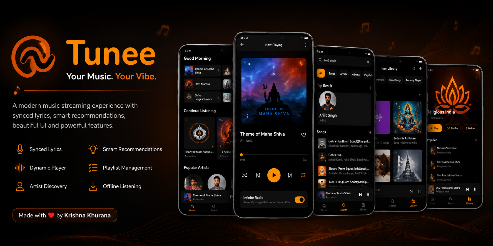
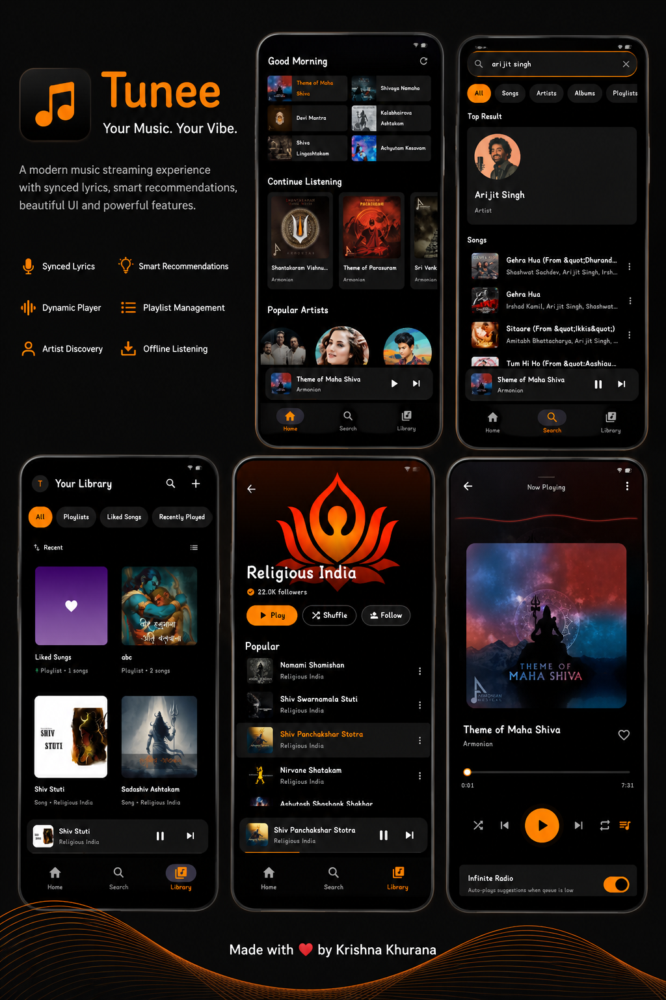

  

<h1>
 Tunee</h1>

### Your Music. Your Vibe.

A modern Android music streaming application featuring synced lyrics, dynamic audio visualizations, artist discovery, smart recommendations and a premium listening experience.

---

## ✨ Features

- 🎵 High Quality Music Streaming
- 🎤 Real-Time Synced Lyrics
- 🌊 Dynamic Audio Wave Visualizer
- 🎨 Dynamic Color Extraction from Album Artwork
- 👤 Artist Profiles & Discovery
- ❤️ Like Playlists
- 📌 Save Playlists
- 📦 Offline Cache Support
- 🧠 Smart Recommendations
- ⚡ Fast Playback Experience
- 🔄 In-App Update System
- 🖤 Modern Black & Orange UI

---

## 📱 Screenshots

---

## 🚀 Built With

- Java
- Android SDK
- Media3 / ExoPlayer
- Firebase Remote Config
- Glide
- Room Database
- Material Components

---

## 🎯 Why Tunee?

Tunee was built from scratch with a focus on performance, simplicity and user experience.

Unlike traditional music applications, Tunee combines:

- Beautiful dynamic visuals
- Seamless playback
- Real-time synced lyrics
- Intelligent recommendations
- Clean and distraction-free design

into a single modern music experience.

---

## 📥 Download

Release builds will be available soon.

---

## 🛣 Roadmap

### Version 1.0
- [x] Music Streaming
- [x] Synced Lyrics
- [x] Artist Profiles
- [x] Playlist Management
- [x] Dynamic Audio Visualizer
- [x] Smart Recommendations
- [x] Offline Cache
- [x] Update System
- [x] Ringtone Creator

### Future Updates
- [ ] Sleep Timer
- [ ] Enhanced Offline Experience
- [ ] Music Wrapped

---

## 👨‍💻 Developer

Built with ❤️ by **Krishna Khurana**

---

### Tunee 🎵

Modern Music Streaming Experience

